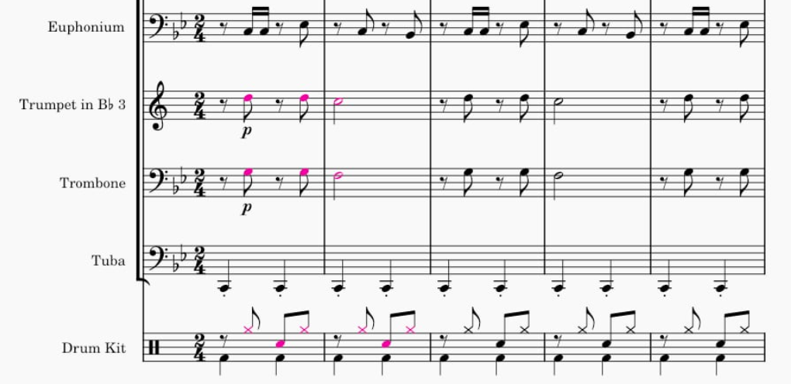

# mscz-differ

Compares two MuseScore files and colorizes notes that are different.

## Usage

Consider having two similar .mscz files
 - `a.mscz`
 - `b.mscz`

Running `./mscz-differ.py a.mscz b.mscz` creates two new files
 - `a-b.mscz`
 - `b-a.mscz`

`a-b.mscz` have exactly the same content as `a.mscz` with the only difference that **the elements not found in `b.mscz` are color highlighted**.

## Usage Examples

 - finding differences among two versions of the same project (as already written above)
 - finding differences among two parts of the same file, e.g. when merging two consecutive verse sections into one repeated section
   - this requires to extract each verse section into own separate file before applying this differ

## Current Limitations

 - currently only Notes diff highlighting is implemented (no other elements like Rest differencing is present)
 - tested on Linux only
 - the cross-check between the two files is done naively in `O(2*m*n)`
